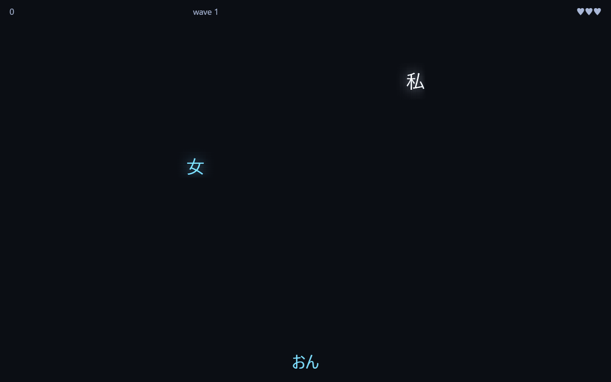
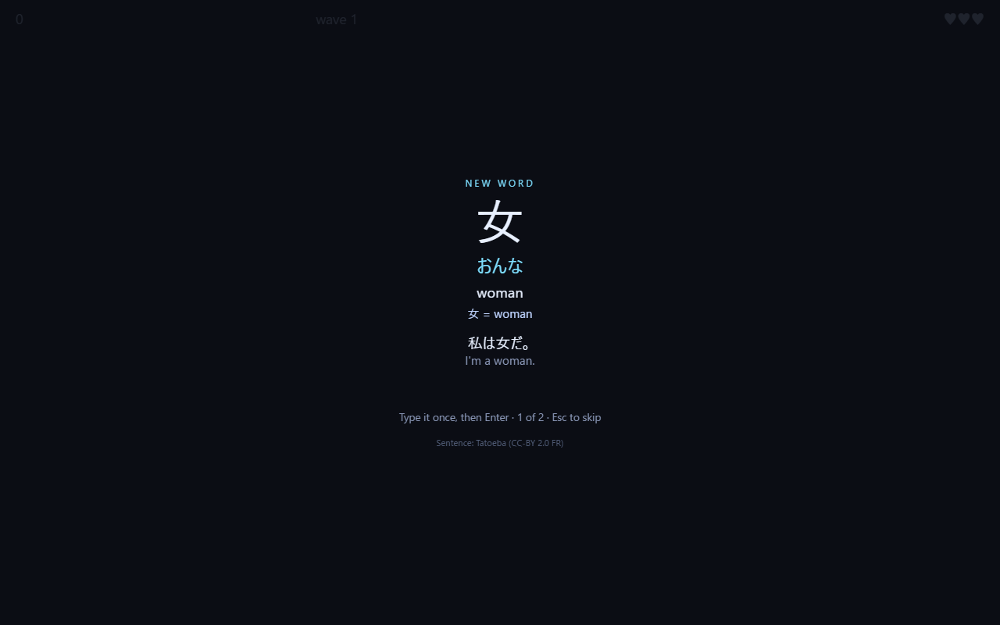

# KanjiFall

**A falling-words Japanese typing game that teaches you JLPT vocabulary while you play.**

JLPT-tagged words fall from the top of the screen. You type the reading in
romaji — converted live to kana — and press Enter to destroy each word before
it hits the floor. Every attempt is recorded to a local SQLite database that
powers a personal analytics profile: words learned, a vocab-only JLPT level
estimate, a 30-day trend, a leech list, and pace tracking against your exam
date.



KanjiFall is a **reinforcement** tool, not a flashcard app: arcade pressure
cements half-known words. New vocabulary arrives through paced *acquisition
ceremonies* — each new word pauses the game to show its reading, meaning, and
an example sentence, and you type it once before it ever falls:



## Features

- **Two modes** — *Reading* (kanji falls, type its reading) and *Recall*
  (English gloss falls, type the Japanese).
- **Teach-first progression** — words are introduced in frequency-ordered
  tiers of 10 per JLPT level; a tier must be ~80% solid before the next
  unlocks, and a daily word goal paces how many new words each run may
  introduce.
- **Weighted review** — words you're weak on or haven't seen recently fall
  more often, spaced-repetition style.
- **Revenge runs** — replay exactly the words you missed last run.
- **Custom lists** — paste a word list (e.g. exported from your SRS) and play
  it with the same ceremony + review treatment.
- **Local-first analytics** — everything lives in one SQLite file on your
  machine; nothing leaves it.

## Run it locally

Requires [Node.js](https://nodejs.org) 20 or newer.

```bash
git clone https://github.com/wahnahbe/kanjifall.git
cd kanjifall
npm install
npm run start
```

`npm run start` builds the client, serves the game and API from a single
process at http://localhost:8790, and opens it in your default browser
(best-effort — if it doesn't open, that URL is where the game is).

For development with hot reload (client + API):

```bash
npm run dev
```

`npm run dev` plays at the port Vite prints (5173, or 5174+ if 5173 is
taken), proxying `/api` through to the API on port 8790.

### How to play

Type `a–z` romaji — it converts to kana as you type. **Enter** submits,
**Backspace** edits, **Esc** clears the buffer. Each word that reaches the
floor costs a heart; three gone ends the run. During a ceremony, type the
displayed reading once (or **Esc** to skip — a skipped word still counts as
introduced).

First visit: pick your target JLPT level, exam date, and daily word goal on
the setup screen — the tier gate and pace stats are driven by them.

## Tests

```bash
npm run check        # typecheck + lint + unit/component tests
npm run e2e          # Playwright end-to-end specs (wipes data/e2e.db)
```

First e2e run only: `npx playwright install chromium`. The e2e client runs on
its own port 5183, but the API shares port 8790 with `npm run dev`/`npm run
start` — stop either one before running e2e.

## Your data

Attempts, runs, and your profile live in `data/kotoba.db` (SQLite,
gitignored; the filename predates the KanjiFall rename). The app never
deletes or silently recreates this file — if it can't be opened you get an
error screen with the path and recovery steps instead of a silent reset. To
back it up, stop the server and copy the file (plus its `-wal`/`-shm`
siblings, if present).

## Rebuilding the card data (optional)

The JLPT card files in `public/data/` are committed and deterministic — you
only need this if you change the pipeline in `scripts/build-data.ts`. Place
the raw datasets in `data/raw/` (gitignored):

| File(s) | Source |
|---|---|
| `jmdict-eng-3.6.2.json`, `kanjidic2-en-3.6.2.json` | [jmdict-simplified releases](https://github.com/scriptin/jmdict-simplified/releases) |
| `tatoeba-jpn-eng.tsv` | [Tatoeba downloads](https://tatoeba.org/en/downloads) (English–Japanese sentence pairs) |
| `term_meta_bank_1..5.json` | [yomitan-jlpt-vocab releases](https://github.com/stephenmk/yomitan-jlpt-vocab/releases) (unzip the dictionary) |

Then:

```bash
npm run build:data   # if it OOMs: NODE_OPTIONS=--max-old-space-size=4096
```

Identical inputs produce byte-identical output. Same-kanji homographs within
a level (e.g. 私 わたし/わたくし) are merged into one card that accepts
every reading — reading mode shows only the kanji, so separate cards would
be indistinguishable yet reject each other's correct answers.

## Documentation

Design specs and implementation plans live in `docs/superpowers/` —
`specs/2026-07-22-kotoba-drop-design.md` is the main design document; each
sub-project (word introduction, tiered vocabulary, list import, the juice
pass) has its own dated spec and plan. (The docs predate the rename —
"kotoba-drop" is KanjiFall's original name.)

## Data licenses

- Dictionary entries and kanji data: [JMdict and KANJIDIC2](https://www.edrdg.org/)
  (EDRDG licence), via [jmdict-simplified](https://github.com/scriptin/jmdict-simplified).
- Example sentences: [Tatoeba](https://tatoeba.org) (CC-BY 2.0 FR).
- JLPT level lists: [Jonathan Waller's JLPT resources](https://www.tanos.co.uk/jlpt/)
  (CC-BY), via [yomitan-jlpt-vocab](https://github.com/stephenmk/yomitan-jlpt-vocab).

Code is [MIT licensed](LICENSE).
